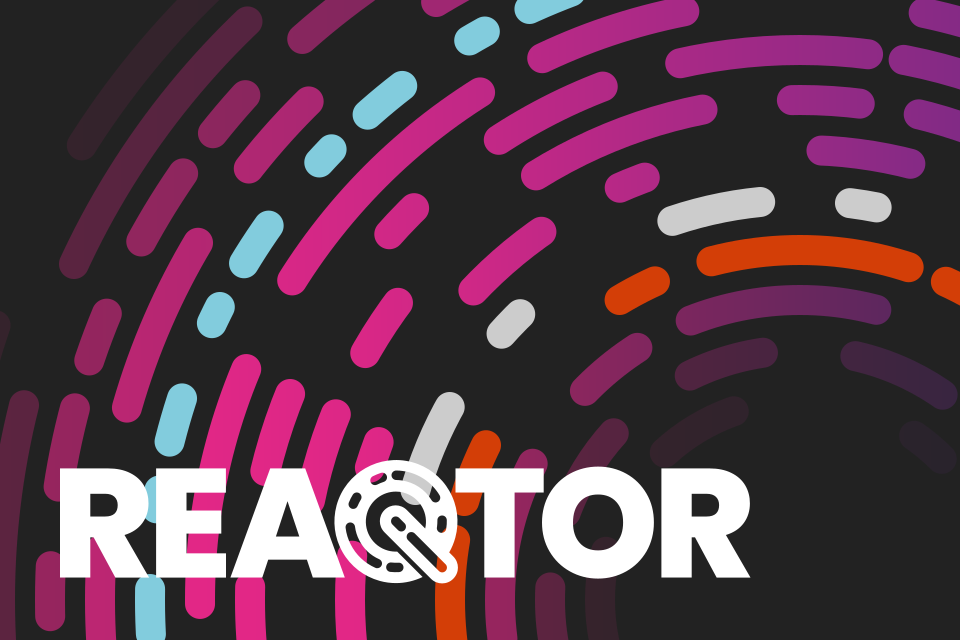

# About Reaqtor

[Reaqtor](https://reaqtive.net) is a framework for reliable, stateful, distributed, and scalable event processing based on [Reactive Extensions (Rx)](https://github.com/dotnet/reactive).

Reaqtor has been in [development for over 10 years](https://reaqtive.net/history). It is the evolution of the Reactive Extensions & powers services across Bing and M365.

## .NET Foundation

Reaqtor is part of the [.NET Foundation](https://www.dotnetfoundation.org/).

## License

Reaqtor is available under the [MIT open source license](https://opensource.org/licenses/MIT).

## Contributor License Agreement

We appreciate community contributions to code repositories open sourced by the .NET Foundation. By signing a contributor license agreement, we ensure that the community is free to use your contributions.

### Review the CLA document
The [.NET Foundation Contributor License Agreement (CLA)](https://github.com/dotnet-foundation/foundation/blob/master/guidance/net-foundation-contribution-license-agreement.pdf) document is available for review as a PDF.

### Sign the CLA
When you contribute to a .NET Foundation open source project on GitHub with a new pull request, a bot will evaluate whether you have signed the CLA. If required, the bot will comment on the pull request, including a link to this system to accept the agreement.

## Code of Conduct

This project has adopted a code of conduct adapted from the [Contributor Covenant](http://contributor-covenant.org/) to clarify expected behavior in our community. This code of conduct has been [adopted by many other projects](http://contributor-covenant.org/adopters/). For more information see the [Code of Conduct FAQ](https://opensource.microsoft.com/codeofconduct/faq/) or contact [&#104;&#101;&#108;&#108;&#111;&#064;&#101;&#110;&#100;&#106;&#105;&#110;&#046;&#099;&#111;&#109;](&#109;&#097;&#105;&#108;&#116;&#111;:&#104;&#101;&#108;&#108;&#111;&#064;&#101;&#110;&#100;&#106;&#105;&#110;&#046;&#099;&#111;&#109;) with any additional questions or comments.

## Acknowledgements 

A list of people who have contributed to the development of Reaqtor is featured in [A History of Reaqtor](https://reaqtive.net/history), by [Bart De Smet](https://github.com/bartdesmet).
